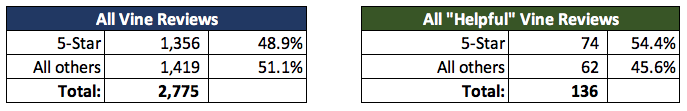
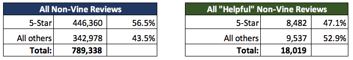

# Amazon Vine Analysis: Furniture Products

## Background
 
The Amazon Vine program is a service that allows manufacturers and publishers to receive reviews for their products from the most trusted and helpful reviewers.  The way it works:

* Amazon Vine invites their most trusted reviewers to post their opinions about new and pre-release items.
* These reviewers are chosen based on their reviewer rank, which is based on the helpfulness and quality of their review as indicated by other Amazon Customers (***i.e. was this review helpful?***)
* The Vine reviewers are sent free products that were submitted by the participating vendors, who pay a small fee to participate.
* The participating vendors cannot influence, modify or edit the reviews. 
* Similarly, Amazon does not modify or edit Vine reviews, unless they violate posting guidelines. 

The value for the participating vendors is to get honest, timely feedback on their products

## Project Overview
The task at hand involves analyzing Amazon reviews, in this case, reviews of **Furniture** products; and determine if there is any bias toward favorable reviews from Vine members in your dataset.

The dataset was downloaded from [Amazon Review Dataset](https://s3.amazonaws.com/amazon-reviews-pds/tsv/index.txt).  Specifically: [https://s3.amazonaws.com/amazon-reviews-pds/tsv/amazon_reviews_us_Furniture_v1_00.tsv.gz
](https://s3.amazonaws.com/amazon-reviews-pds/tsv/amazon_reviews_us_Furniture_v1_00.tsv.gz)

Using PySpark, we will look at the percentages of Amazon Vine vs non-Vine reviews to determine if having a paid Vine review makes a difference in the percentage of 5-star reviews.

In addition to looking at the full dataset, a subset of what are considered 'helpful' reviews is also examined to highlight potential bias.  This subset contains reviews with 20 or more total votes and 50% or more of the total votes.  

## Results

<mark style="background-color: Yellow">**Vine review vs non-Vine review breakdown**:</mark>   
When looking at the **entire Furniture product review file**, we see very few are Amazon Vine reviews:   

Furthermore, applying the same breakdown on the smaller subset of **"helpful" reviews**, still only a nominal percentage come from the Vine program:  

<mark style="background-color: Yellow">**5-Star Reviews Vine vs Non-Vine:**</mark>  
Again, from the entire review dataset, we see very few of the 5-star reviews were Vine reviews, **only 0.3%**  

Isolating the "helpful" reviews makes little difference is the breakdown; **still less than 1%** of the 5-star reviews are coming from Vine participants.  

<mark style="background-color: Yellow">**Percentage of All and "Helpful" Reviews are 5-star:**</mark>  
Looking at all reviews and all "helpful" reviews, **roughly half of the ratings are 5-star**, which indicates that reviewers, regardless of the Vine programs, tend to give 5-stars more than any other star rating.

<mark style="background-color: Yellow">**Percentage of Vine Reviews are 5-star:**</mark>  
Of all the Vine reviews, we still see a similar breakdown, in fact, there are more lower ratings than 5-star ratings.
  

<mark style="background-color: Yellow">**Percentage of Non-Vine Reviews are 5-star:**</mark>  
The basic trend continues with the non-Vine reviews; there is a higher percentage of 5-star non-Vine reviews than 5-star Vine reviews.  

## Summary

These results demonstrate:

1. The vast majority of all reviews for the Furniture product sector are NOT stemming from Vine participants: **99.6% of all reviews are non-Vine**.  
2. Correspondingly, the vast majority of all 5-star reviews are also NOT coming from Vine participants: **99.7% of all 5-star reviews are non-Vine**.
3. Most importantly, there is not a disproportionate number (or percentage) of 5-star reviews coming from Vine participants as opposed to non_Vine particpants.  If anything, more of the 5-star ratings come from non-Vine reviewers.

Therefore, **there does NOT appear to be bias toward favorable reviews from Vine members** for this product sector.

### Recommendations
Two recommendations for next steps:

1. This exercise determines favorable bias based on the 5-star rating; however, a favorable review could be considered **4- or 5-star**.  In which case, these comparisons could be re-run including both ratings to see if a bias emerges.  

2. There is so much data not involving Vine participants in this specific product group, that we could minimize the "noise" and create a subset that focuses on just Vine products.

Pulling only reviews for Vine participating Product IDs and joining that with the full dataset (on Product ID) will create a table with all reviews (Vine and non-Vine) that involve a Vine participating product.

The resulting dataset includes only 10,689 reviews; and **approximately 1/4 are Vine Reviews**, *much higher than the less than 1% when involviong the entire dataset!*   
  

Of all the reviews for these specific Product IDs, **57% involve 5-star reviews**.  *This is very similiar to the results of the entire dataset (56.5% have 5-star review)*  
  

Of all the Vine Reviews for these specific Product IDs, **49% involve 5-star reviews**, which of course the same view as the previous 'All Vine Reviews 5-Star'    
   

Of all the non-Vine Reviews for these specific Product IDs, **60% involve 5-star reviews**. This is of course a much smaller number (4,737) than the previous view involving the original dataset, but the pecentage is similar.  
 

Effectively the results come to the same conclusion: there is little difference in the occurrance of a 5-star rating from a Vine reviewer than a non-Vine reviewer, which indicates **there is no favorable bias**.
